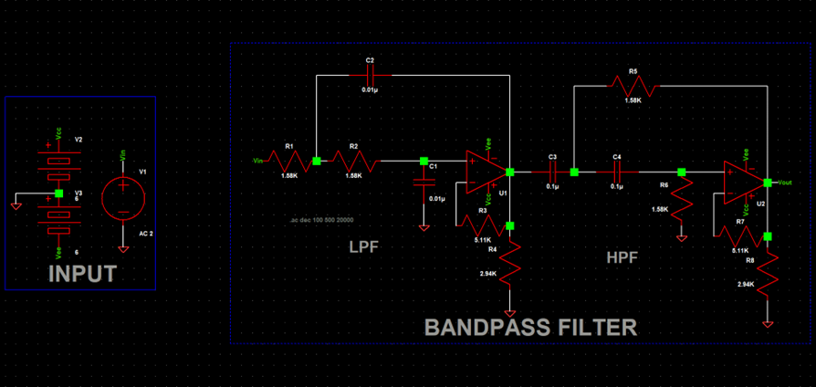
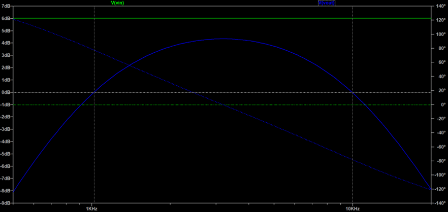
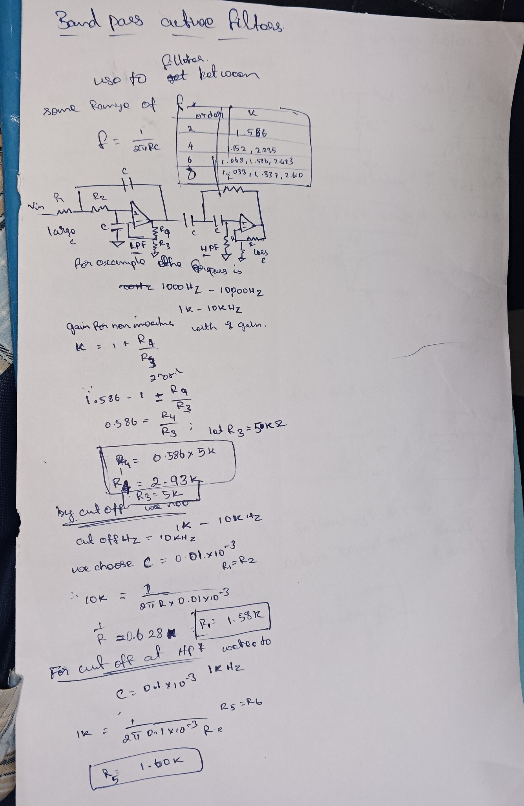

# 🔊 Sallen-Key Band-Pass Filter (Active Filter)

  <b>Design and simulation of a second-order active band-pass filter using LTspice</b>

---

## 📌 Overview
This project demonstrates the design and simulation of a **second-order Sallen-Key Band-Pass Filter** using LTspice.

A band-pass filter allows signals within a specific frequency range to pass while attenuating frequencies outside this range.

---

## ⚙️ Circuit Description
The circuit is implemented using an operational amplifier to achieve an **active band-pass response**.

It is designed to:
- Reject low-frequency signals  
- Pass mid-frequency signals  
- Attenuate high-frequency signals  

---

## 🧪 Simulation Details
- **Software:** LTspice  
- **Analysis:** AC Sweep (.ac dec)  
- **Frequency Range:** 100 Hz – 100 kHz  

---

## 📈 Circuit Diagram

  

---

## 📉 Output Waveform

  

---

## 📝 Design Notes & Calculations

  

---

## 📊 Observations
- Output is low at low frequencies  
- Maximum gain occurs in mid-frequency range  
- Output decreases at high frequencies  
- Clear band-pass response is observed  

---

## 🎯 Applications
- Audio filtering  
- Communication systems  
- Signal processing  

---

## 📂 Project Files
- LTspice simulation file (.asc)  
- Project report (DOCX)  
- Circuit and waveform images  
- Design notes  

---

## 📚 Reference
R. L. Boylestad and L. Nashelsky, *Electronic Devices and Circuit Theory*, 11th ed., Pearson, 2013.

---

## 🧑‍💻 Author
**THANGAVIKRAMAN RAMACHANDRAN**  
B.E Electronics and Communication Engineering

🔗 LinkedIn: https://www.linkedin.com/in/thangavikraman-ramachandran/  
